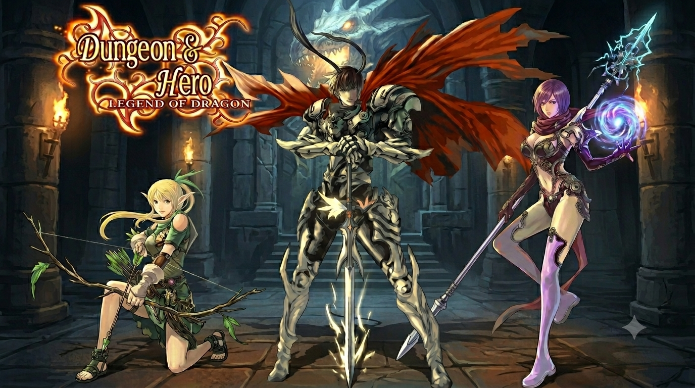

# Dungeon & Hero

**Dungeon & Hero** is a 2013 feature phone RPG developed by **Fansigame Project (FGP)** in the style of classic titles like Final Fantasy and Dragon Quest. It features pixel art, turn-based combat, and dungeon exploration. Originally released as a Java ME game, it was later ported to Android.



## Story

In a fantasy realm, a young adventurer must explore perilous dungeons, defeat monsters, and uncover a powerful ancient artifact before the forces of darkness can claim it. Along the way, they encounter companions, merchants, and mysterious characters who help - or hinder - their quest.

## Features

- Classic turn-based RPG combat
- Pixel art style inspired by 8-bit and 16-bit era games
- Dungeon exploration with traps and puzzles
- Equipment, item, and magic systems
- Multiple enemy types and boss battles
- NPC interactions and side quests
- Compact game suitable for low-end devices

## Platforms

| Platform | File |
|----------|------|
| Java ME (original) | `Dungeon And Hero.jar` |
| Android (original FGP-signed) | `[FGP]Dungeon&Hero [o.1.0.0 - v.1.0.0].apk` |
| Android (modern, API 21+) | `Dungeon And Hero (Modern Android).apk` |

## Release Contents

```
res/
├── README.md
├── [FGP]Dungeon&Hero [o.1.0.0 - v.1.0.0].apk
└── img/
    └── wall.png
```

## Credits

- **Developer**: Fansigame Project (FGP)
- **Original release year**: 2013
- **Genre**: Turn-based RPG

## Legacy

The game was distributed on feature phone app stores and various Java game sites. As Java ME support declined, fan efforts preserved the game by repackaging it for Android. This repository serves as an archive of those preservation efforts.

## License

All game assets and binaries are the property of Fansigame Project (FGP). This archive is provided for preservation purposes only.
